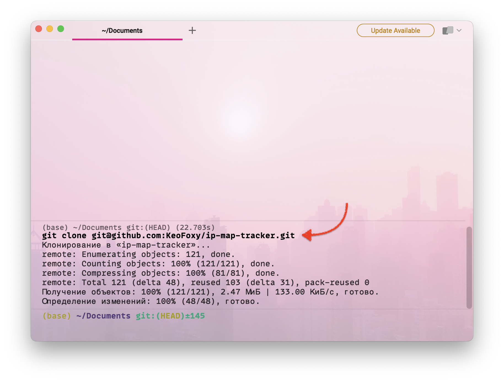
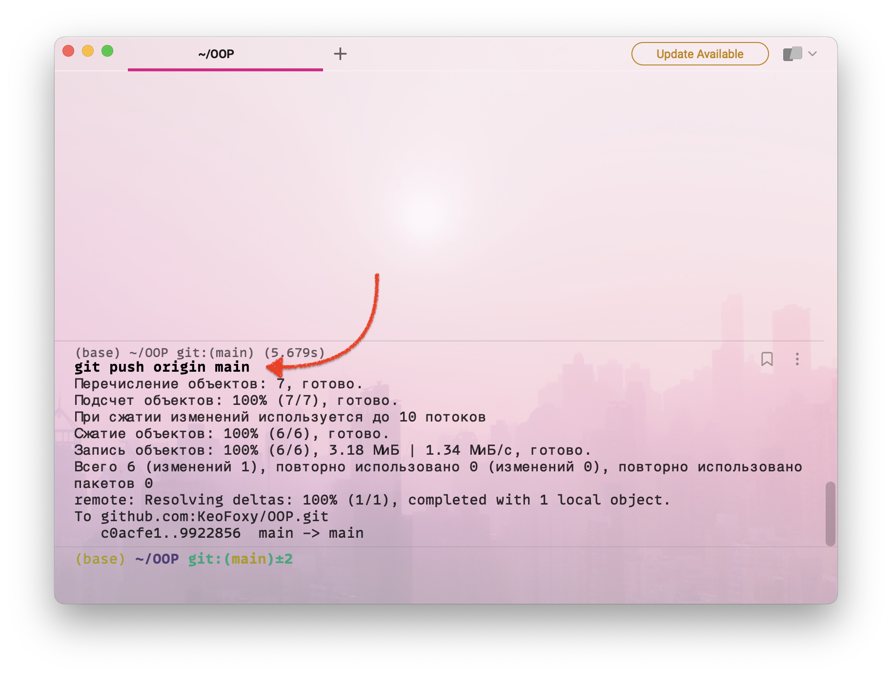
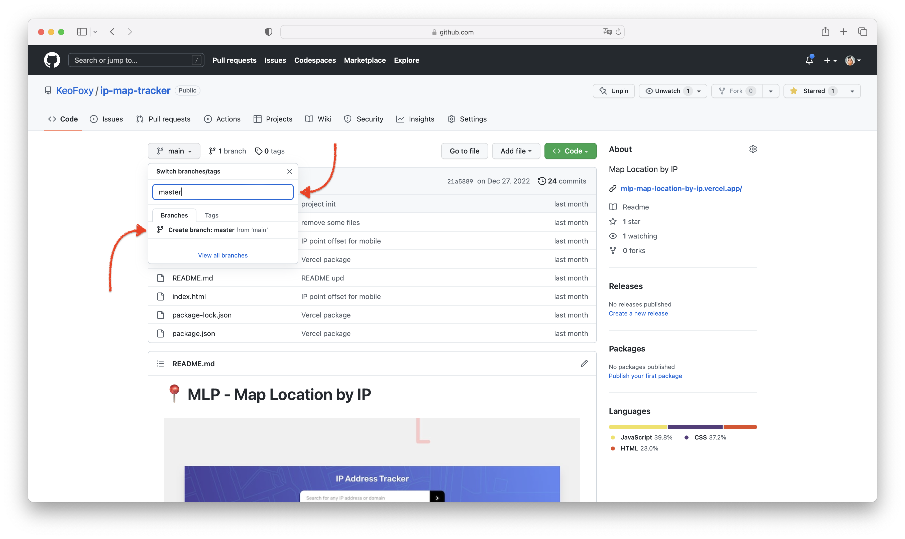

# Git. Что это такое и с чем его едят. 
[**Список основных команд**](#список-основных-команд)  
[**Если вдруг что-то непонятно, то вам сюда — FAQ**](#faq)  

## Установка Git  

Для начала нам необходимо установить систему Git на устройство.  

Скачать инсталлятор можно на [официальном сайте](https://git-scm.com/download/win).  

Рекомендуется использовать VPN при скачивании, так как может быть очень низкая скорость загрузки для российских пользователей.  

Для пользователей **MacOS** установка выполняется через терминал следующим образом (необходимо иметь менеджер пакетов [brew](https://brew.sh/index_ru)):  

`$ brew install git`  

### Терминалы  

Базовые терминалы в Windows и MacOS оставляют желать лучшего.  

Мои рекомендации по терминалам:

Для пользователей  
* GitBash. Устанавливается вместе с системой Git.
* PowerShell. Установлен вместе с ОС.
* [Hyper](https://hyper.is/)

Для пользователей 

* [Warp](https://www.warp.dev/)
          
          

## **Настройка Git**  

После установки Git необходима настройка — указать ваше имя и адрес электронной почты. Это важно, потому что каждый коммит в Git содержит эту информацию, и она включена в коммиты, передаваемые вами, и не может быть далее изменена.  
Открываем [терминал](#как-открыть-терминал) и вводим команду:  

`git config --global user.name "Name"`  

Пример: `git config --global user.name "Nezuko"`   

Следующая команда:  

`git config --global user.email почта`   

Пример: `git config --global user.email afterlife@gmail.com`  

Отлично! Настройка git завершена.

## **Регистрация на GitHub**  

          
Переходим на [сайт Github](https://github.com/) и регистрируемся. Не забудьте подтвердить почту.  
Поздравляю! Теперь у Вас есть аккаунт на GitHub.

## **SSH-Ключ**  
Как настроить **SSH-ключ** вы можете прочитать в [**этой статье**](https://htmlacademy.ru/blog/useful/git/git-console) или в [**этой**](https://www.atlassian.com/git/tutorials/git-ssh), на крайний случай вам может помочь [**официальная документация GitHub**](https://docs.github.com/en/authentication/connecting-to-github-with-ssh/generating-a-new-ssh-key-and-adding-it-to-the-ssh-agent).   

Если что-то не получается, то пишите в 

## **Работа с репозиториями**  

После того, как мы установили git, настроили его и зарегистрировались на GitHub, можно приступать к работе.  

### Создаем репозиторий на GitHub.  

  

После того, как мы создали репозиторий, у нас появилась возможность клонировать его себе на устройство. Рекомендуется пользоваться SSH ссылкой.  

  

Копируем ссылку, открываем терминал и используем команду  
`git clone наша-ссылка`

Предварительно необходимо зайти в нужную директорию, куда вы хотите поместить проект.

  

После того, как репозиторий успешно клонировался, необходимо перейти в его папку.  

`cd ./имя-репозитория`  

С этого момента все изменения внутри папки будут отслеживаться системой git. 

### Добавление файлов для коммита. Git add.
Чтобы зафиксировать изменения и отправить в наш репозиторий необходимо выполнить следующие действия:

`git add -A` добавить все файлы или `git add file-name` чтобы добавить конкретный файл для коммита.  

### Git commit.

`Commit (коммит)` - это одна из основных концепций в системе контроля версий Git. Коммит представляет собой снимок состояния вашего проекта в определенный момент времени. Каждый коммит содержит сообщение, описывающее изменения, внесенные в проект, и хеш, идентифицирующий этот коммит. Коммиты образуют историю изменений вашего проекта, которую можно исследовать и восстанавливать в любой момент.

`git commit -m "Сопроводительное сообщение"`

Важно! Пишите осмысленные и информативные сообщения к коммитам чтобы другие разработчики могли понять какие изменения пришли в ветку или репозиторий.

Коммитов может быть несколько. Не сгребайте все измененные файлы в один коммит. Если у вас произошли изменения в разных областях проекта, то к каждой области проекта свой коммит со своим описанием.

### Отправка изменений в репозиторий. Git push.

После того, как все коммиты сделаны, можно оправлять изменения в репозиторий.  

`git push` - это команда Git, которая используется для отправки изменений с локальной ветки в удаленный репозиторий. Эта команда отправляет все коммиты, сделанные на локальной ветке, в удаленный репозиторий, тем самым обеспечивая синхронизацию истории изменений между локальным и удаленным репозиториями.  

Для этого используется команда `git push <remote> <branch>`

где `<remote>` - это имя удаленного репозитория, а `<branch>` - это имя ветки, которую вы хотите отправить в удаленный репозиторий.  

Для вашего личного репозитория можно не указывать имя репозитория, а писать `origin`. По-умолчанию на Github создается основная ветка `main`.

`git push origin main`

  

### Ветки. Branch

Branch (ветка) - это одна из основных концепций в системе контроля версий Git. Ветка представляет собой отдельный путь развития проекта, на котором вы можете вносить изменения в код, не затрагивая другие ветки.

Например, вы можете создать ветку для разработки новой функциональности, в то время как другие члены команды продолжают работать над основной веткой. После того, как новая функциональность будет готова, вы можете слить свою ветку с основной веткой.

В Git можно создавать столько веток, сколько потребуется для разработки вашего проекта, и переключаться между ними в любое время. Это позволяет вам работать над разными версиями проекта одновременно, не затрагивая друг друга.

Создать новую ветку можно двумя способами:

* `git checkout -b имя-новой-ветки`
* На странице репозитория. Пишете название новой ветке и создаете

Чтобы переключаться между ветками используйте коменду:  

`git checkout имя-ветки`

### Мусор в репозитории. Git ignore.

Зачастую IDE создают слишком много ненужных нам файлов и папок, которые никак не относятся к проекту и каждый раз генерируются заново. Чтобы все это не вносить в наш репозиторий и не захламлять его, существует такая вещь как `.gitignore`  

Думаю, что название говорит само за себя. Это файл, который создается внутри папки проекта и в нем указываются папки, файлы, расширения, которые мы не хотим чтобы система git отслеживала.  

К примеру, если вы работаете с пакетами npm, то ваша папка node_modules может весить несколько сотен МБ и содержать десятки тысяч файлов. Поэтому подобную папку сразу отправляют в `gitignore`

Для большинства IDE уже существуют готовые ignore-файлы, который содержат в себе расширения и папки. Интернет в помощь.

Важно! файл `.gitignore` создается обязательно с точной в начале!

### Синхронизация с удаленным репозиторием. Git pull.

`git pull` - это команда Git, которая используется для синхронизации вашей локальной версии репозитория с удаленным репозиторием. Она извлекает изменения с удаленного репозитория и применяет их к вашему локальному репозиторию.

Эта команда часто используется в случае, когда другие члены команды вносят изменения в удаленный репозиторий, и вы хотите убедиться, что ваш локальный репозиторий синхронизирован с последней версией.

`git pull <remove> <branch>`  

где `remote` - это имя удаленного репозитория, а `branch` - это имя ветки, которую вы хотите синхронизировать.

## Список основных команд   
`git clone ссылка-на-репозиторий` - Клонировать репозиторий 

`git checkout -b имя-новой-ветки` - Создать новую ветку 

`git checkout название_ветки` - Переключиться на ветку 

`git branch -m старое-имя-ветки новое-имя-ветки` - Сменить название ветки  

`git status` - проверить статус ветки  

`git add -A` - добавить все файлы в изменения  

`git add имя-файла` - добавить файл в изменения  

`git commit -m "Ваше сообщение"` - создать коммит  

`git push origin название-текущей-ветки` - отправить изменения в репозиторий. `origin` в данном случае ваш репозиторий.   

`git pull название-репозитория название ветки` - синхронизировать ваши файлы на устройстве с репозиторием.

`git remote add название-репозитория git@github.com:your-repo.git` - добавить ссылку на репозиторий  

## FAQ

### Как открыть терминал
* Windows: **Windows + R**.  

В появившемся окошке пишем `cmd` и нажимаем Enter. Также можно прописать `cmd` в строке адреса текущей папки. Терминал откроется ее адресу.

* MacOS: **command + space**. В spotlight пишем **terminal**.

### Переход в папки
[**Статья по работе с командой cd**](https://comp-security.net/%D0%BA%D0%B0%D0%BA-%D0%BF%D0%B5%D1%80%D0%B5%D0%B9%D1%82%D0%B8-%D0%B2-%D0%BF%D0%B0%D0%BF%D0%BA%D1%83-%D0%B8%D0%BB%D0%B8-%D0%BD%D0%B0-%D0%B4%D1%80%D1%83%D0%B3%D0%BE%D0%B9-%D0%B4%D0%B8%D1%81%D0%BA/)  

### Вопросы и проблемы

Проблемы сюда:  

  

Вопросы сюда:

