## :hammer_and_wrench: Установка Qt Creator 

          
По всем вопросам сюда: 

Первое, что вам необходимо сделать - скачать заранее собранный Qt Creator.

Скачиваем вот [тут](https://drive.google.com/drive/folders/1lT53UV4X0VHyxPOT4AFTFOzwzf9ngqoy?usp=sharing).

Большинству из вас нужен архив под названием **QtCreator**.  

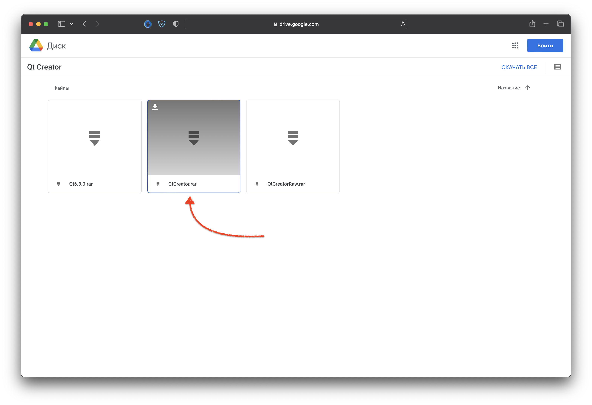

Внутри также есть отдельно библиотеки Qt версии 6.3.0 и отдельно Qt Creator без библиотек.  

Распаковываете архив куда вам нужно.

### :x: Путь, куда вы устанавливаете Qt Creator, не должен содержать русских букв! Иначе, у вас не будут собираться проекты! :x:

Особенно это играет роль, если у вас система на русском языке.

В папке `bin` находится заветный exe файл QtCreator.  

**:warning:** ***Перед запуском самого Qt Creator у вас уже должны быть установлены компиляторы C/C++*** **:warning:** 
В противном случае, вы будете получать ошибку о нехватке различных .dll библиотек. 

Если они у вас уже установлены, то настраивайте Qt Creator, если нет, то [читаем как установить](#как-установить-компилятор).  

## :wrench: Настройка Qt Creator  

Переходим в раздел **Tools**. Раздел **Options**. **Kits**.

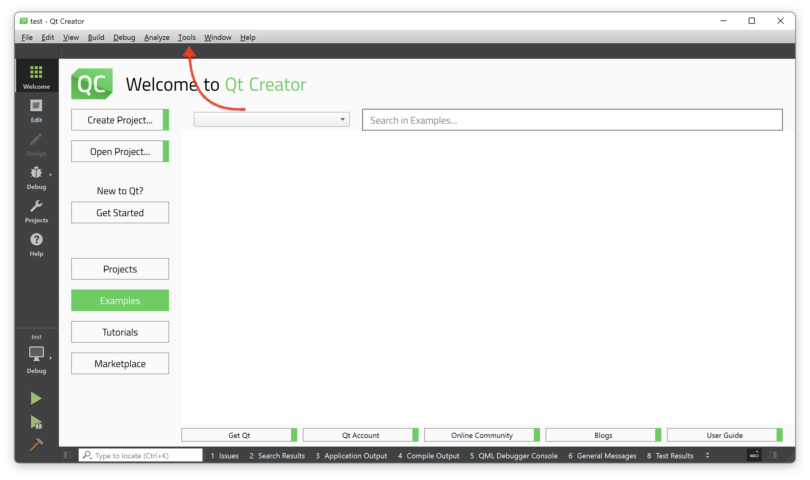  

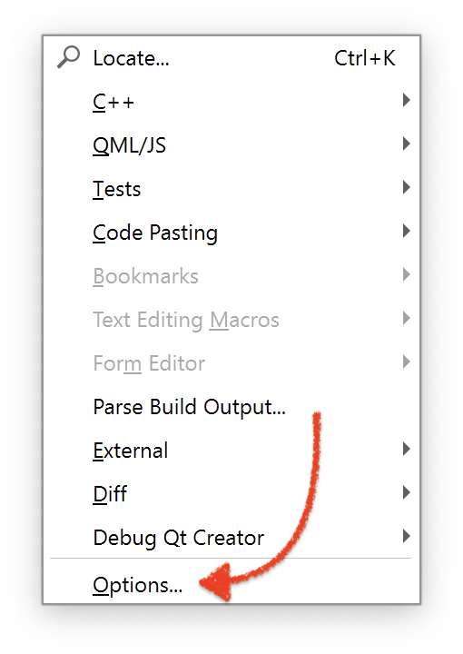

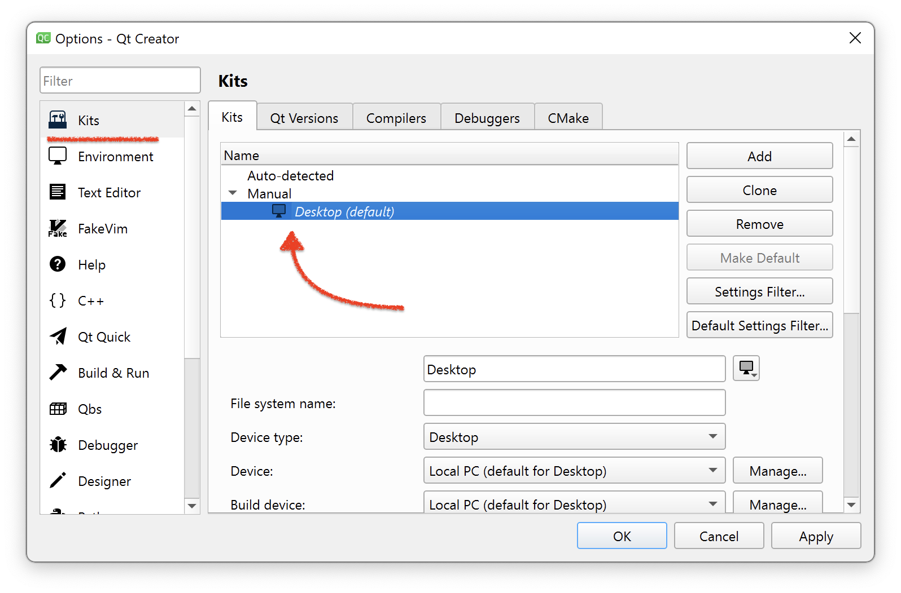

Листаем ниже. 

Наша задача настроить вот эти 4 поля:  

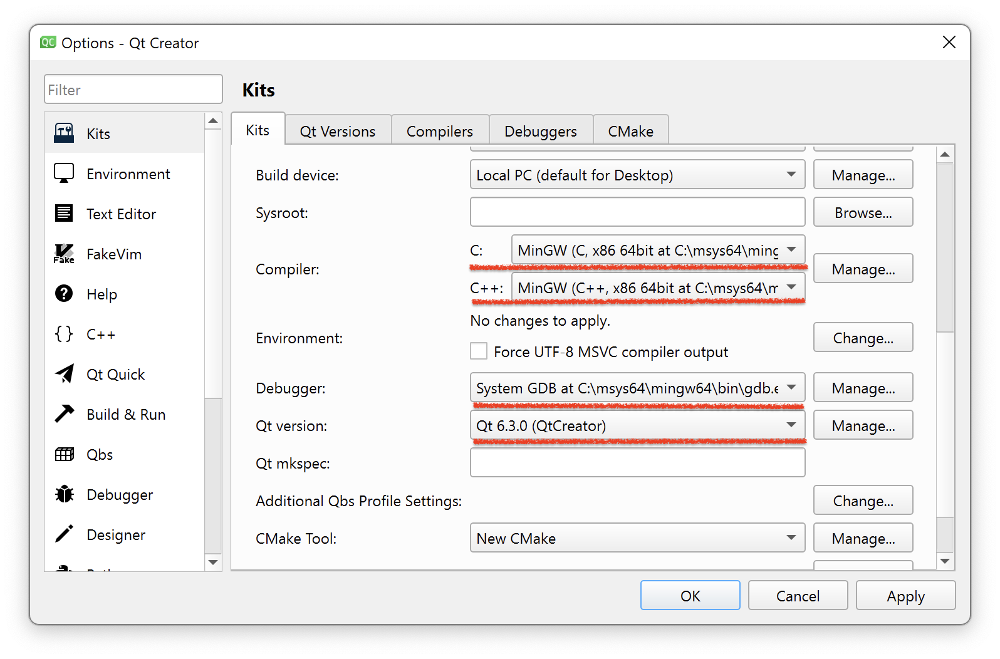

Компиляторы и дебаггер у вас, скорее всего, автоматически определятся и их не придется настраивать, но если там ничего нет, то добавляем руками.  

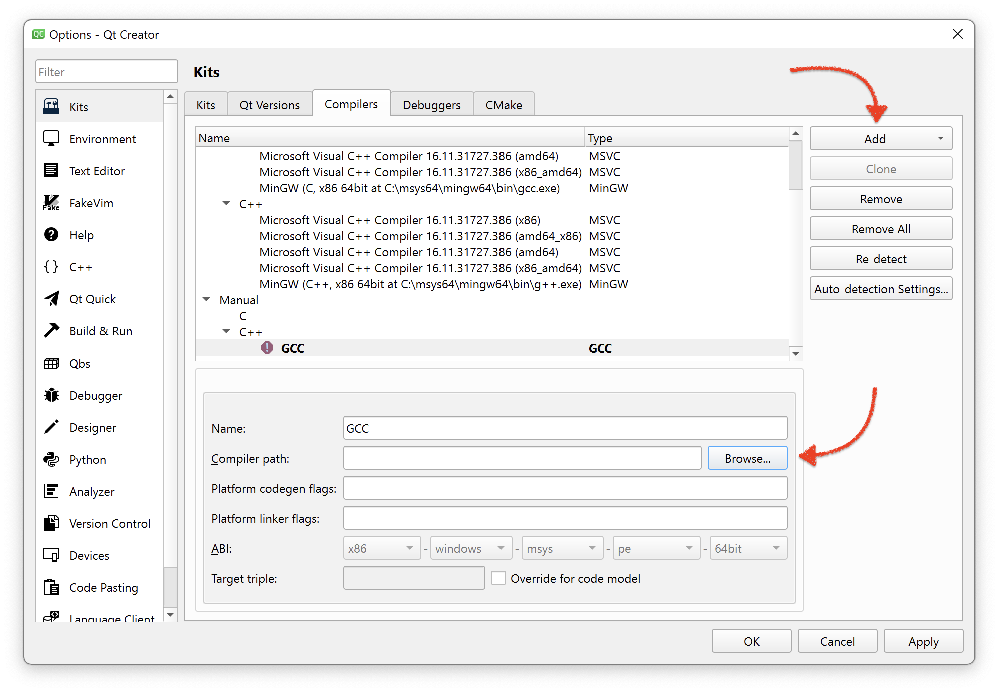  

Необходимо просто указать путь до компилятора или дебаггера.  

* C - `gcc`
* C++ - `g++`
* Debugger - `gdb`

## QMake и CMake

Для того, чтобы наши проекты собирались и работали, нам необходимо добавить qmake или cmake. В зависимости от того, какой проект вы создаете.  

Если в kit у вас не настроены эти пункты, то и выбрать его вы не сможете.  

### QMake  

Здесь все аналогично компиляторам.  

Нажимаем **Manage**, **Add** и указываем путь к qmake файлу.

Хранится он в папке bin Qt Creator'a!

`../QtCreator/bin/qmake`

  

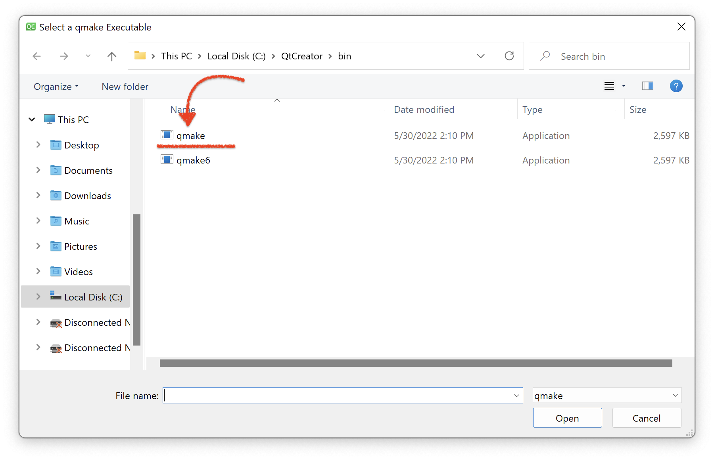  

Готово! Можно создавать проект и писать код. 

Подождите минутку, советую вам поставить еще и CMake.  

### CMake

          

Для этого опять переходим в **MSYS** и устанавливаем `CMake`   

`pacman -S mingw-w64-x86_64-cmake`  

Дожидаемся завершения установки.  

Теперь добавим в kit CMake. Действия аналогичны qmake:  

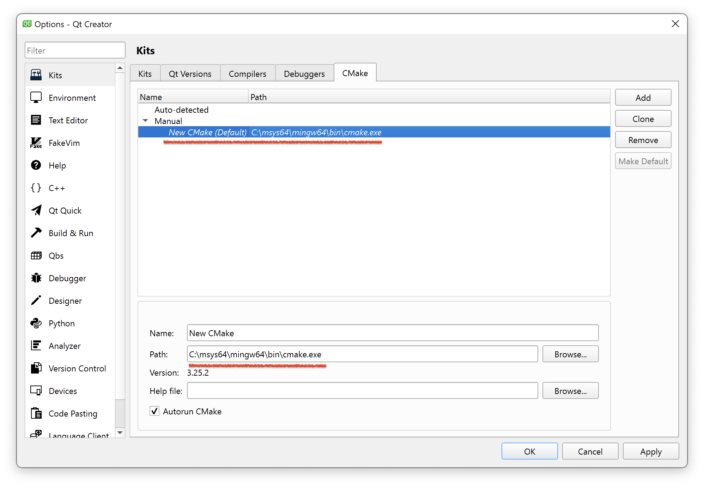

Все! Теперь можно смело создавать проекты и на qmake, и на CMake.

## Как установить компилятор

          

Первым делом нам понадобится [MSYS](https://www.msys2.org/).  Переходим по ссылке, скачиваем и устанавливаем.  

Далее открываем терминал MSYS. Находится он у вас примерно по следующему пути:  
`C:/msys64`  

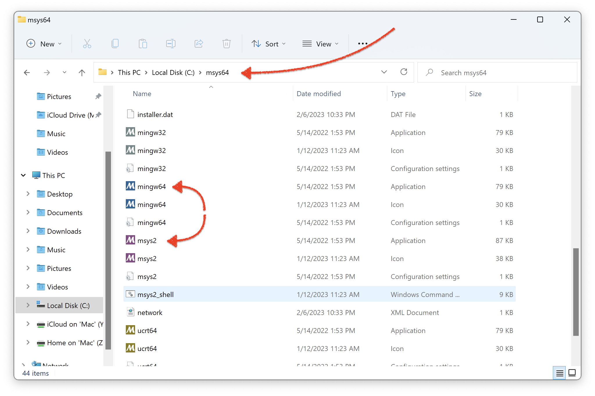  

Запускаем что-то из этого. Не принципиально важно.  

Установим компиляторы.  

`pacman -S mingw-w64-x86_64-toolchain`  

Дополнительно поставьте себе **clang**. Это сделать нужно, иначе будет появляться ошибка нехватки dll.

`pacman -S mingw-w64-x86_64-clang`

P.S Ctrl + V не сработает. Используйте shift + insert, если хотите скопировать и вставить команду.

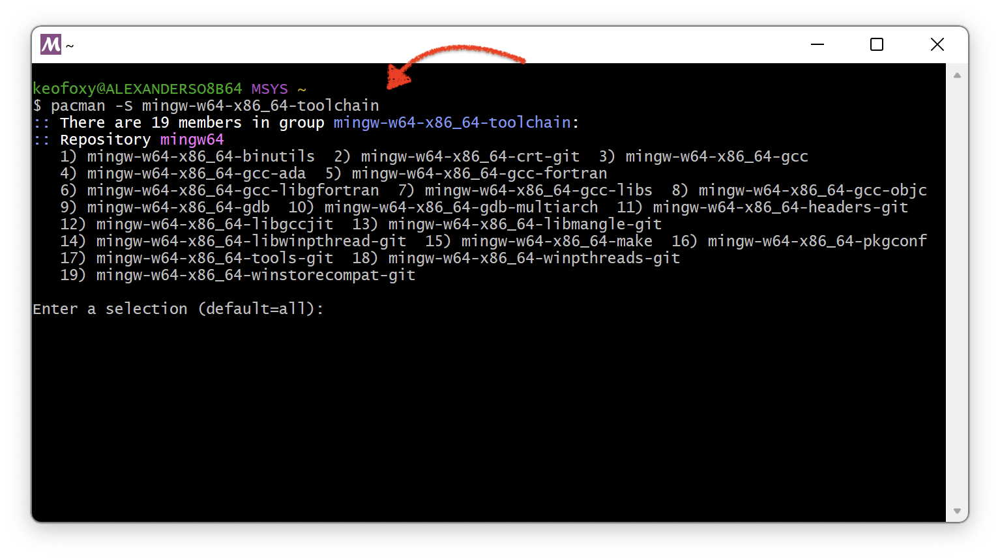  

Нажимаем Enter и после пишем Y, ждем установки.  

После установки наши компиляторы появятся в папке по адресу:  

`./msys64/mingw64/bin`  

Там будет много разных файлов, но нас интересуют 3 основных:  

`gcc`, `g++`, `gdb`

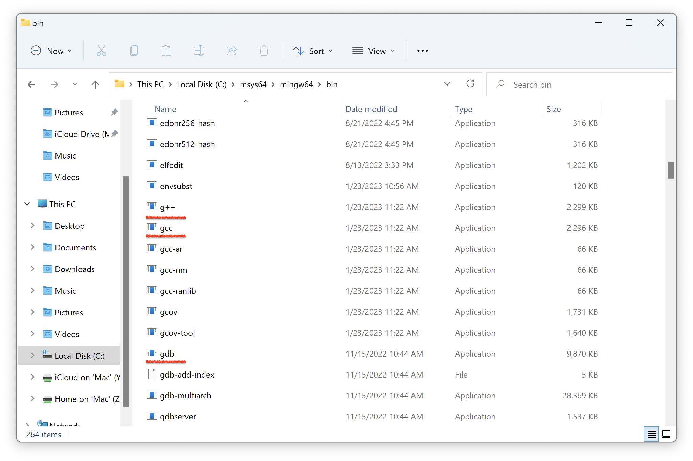  

Теперь добавим их в PATH.  

Для этого в поиске Windows находим **Изменение системных переменных среды**

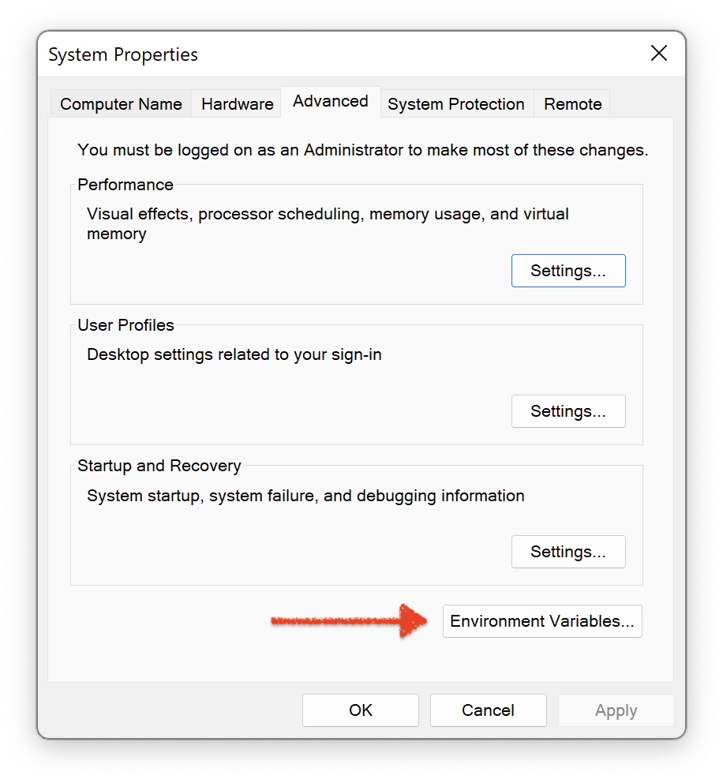  

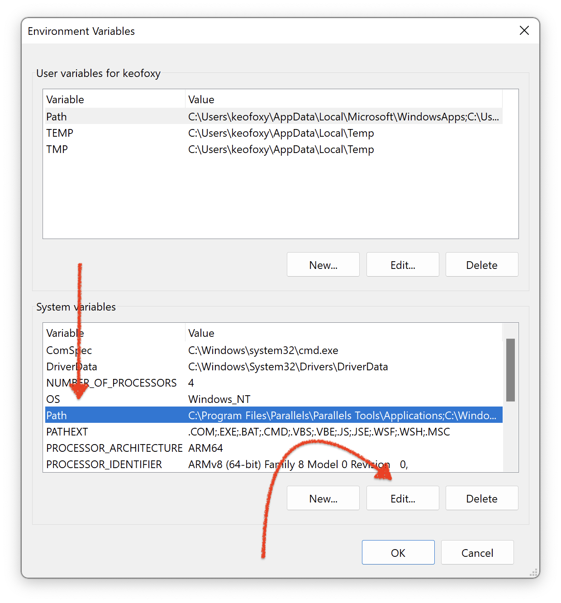

Вставляем сюда путь к нашим компиляторам и отладчику.  
Чтобы быстро скопировать путь к папке, находясь в ней, просто нажимаем сюда:  

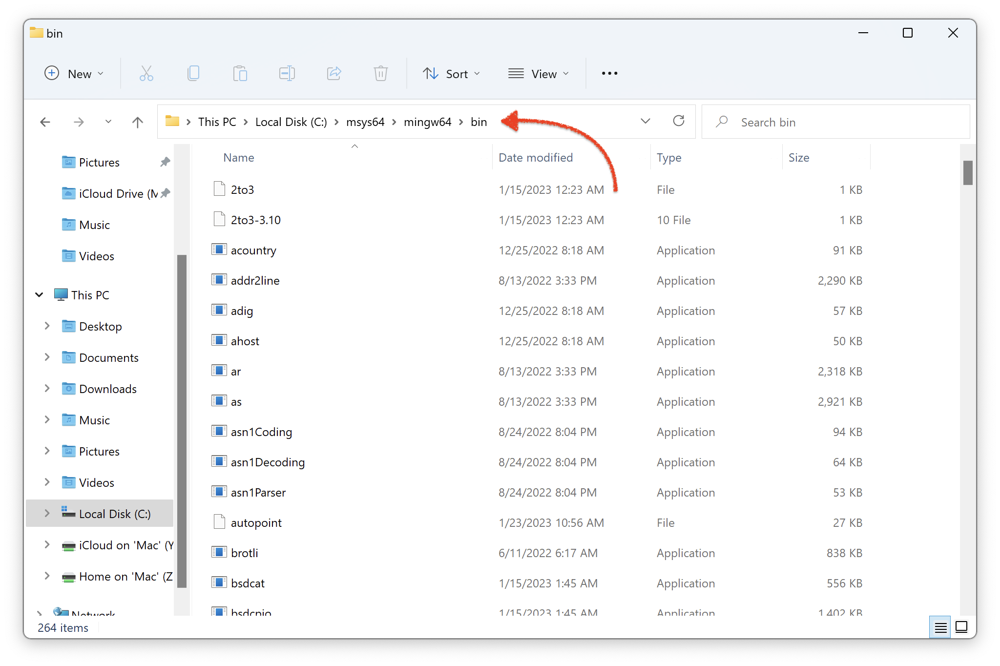  

И теперь просто копируем его и вставляем.   

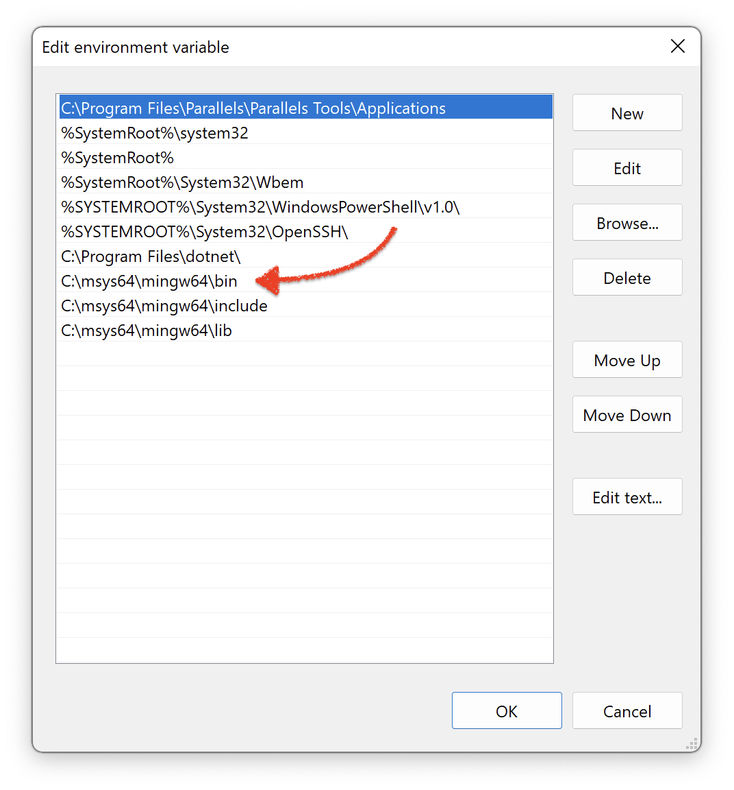  

Готово!

Проверим наличие компилятора.  

С `gcc -v`  
C++ `g++ -v`

Если на обе команды вы не получили ошибки по типу `bash: command not found`, то все хорошо.  

Если же получили ошибку, то ставим отдельно компилятор:   

`pacman -S gcc`  

Компиляторы мы с вами установили, теперь вернемся обратно к настройке Qt Creator. [тык](#настройка-qt-creator)

