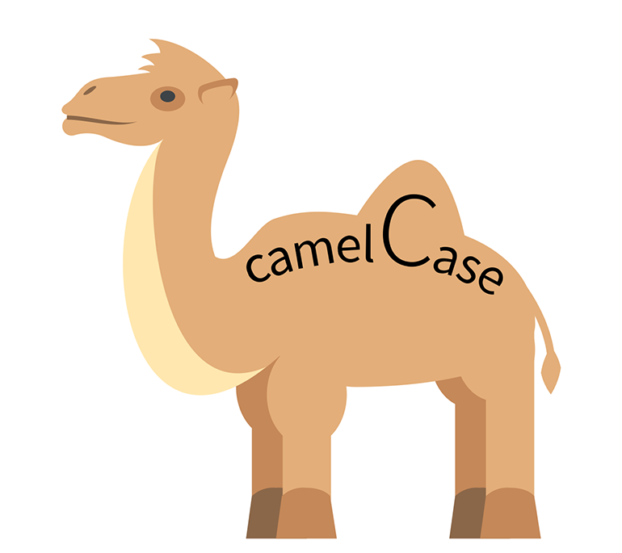
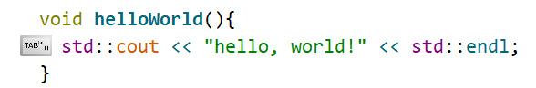
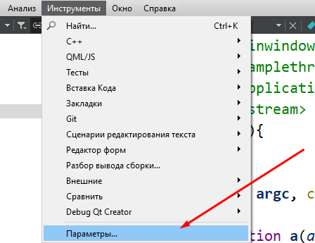
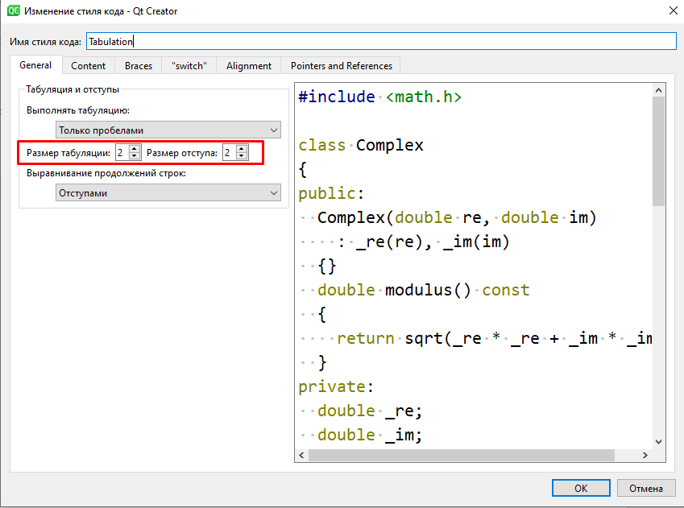

# C++ Style Guide 
 
 
## ⏱ Время на чтение: 20 минут  
Данный гайд создан с целью улучшить Ваш код на С++ за минимально короткий срок.

Гайд включает в себя следующие разделы:

1. **[Присваивание имен](#naming)**  
  1.1 [Выбирай имя с умом](#how_to_select_name)  
  1.2 [Как правильно называть переменные](#how_to_name_variables)  
  1.3 [Как правильно называть функции](#how_to_name_functions)  
  1.4 [Как правильно называть классы](#how_to_name_classes)  
  1.5 [Выводы по присваиванию имен](#how_to_name_conclusion)  

2. **[Немного о комментариях](#comments)**  

3. **[Форматирование кода](#code_format)**  
  3.1 [Что такое табуляция](#what_tab_is)  
  3.2 [Форматирование конструкций ветвления](#if)  
  3.3 [Форматирование циклов](#cycles)  
  3.4 [Форматирование функций](#functions)  

4. [🔥**Работа с классами**](#🔥-работа-с-классами)  

---

## Присваивание имен <a name=naming></a>

**Нейминг** (от англ. *Naming*) - процесс присваивания имен каким либо объектам в коде.
Данный раздел посвящен основным принципам грамотного присваивания имен переменным, функциям, классам. Несмотря на то, что правила именования довольно ситуативны, существуют некоторые основные принципы, основываясь на которых, можно существенно повысить качество своего кода.

## 💡Выбирай имя с умом <a name=how_to_select_name></a>

Первое, и, возможно, самое главное правило: 
> Имя любому объекту вашей программы, будь то переменной, функции или классу, должно выбираться осмысленно. 

"Легко сказать, трудно сделать", не правда ли?

Осмысленный выбор имени - это комплексная процедура, необходимо учитывать контекст, в котором данное имя используется. Можно выделить следующие общие принципы:
   
   * Имя должно быть емким, при этом передавать суть его использования, возможно использовать несколько слов; 
   * Не следует использовать аббревиатуры, кроме общеизвестных;
   * При сокращении слов в имени нужно оценивать ущерб читабельности кода.

Допустим, где-то в коде объявлена переменная:
```cpp
int n = 0;
```
**В зависимости от контекста**, это имя может быть как хорошим, так и не самым удачным.
Например, переменная `n` может использоваться в качестве счетчика внутри небольшой функции. В таком случае, такая короткая запись вполне оправдана:

👍

```cpp
int CountSomething(const std::vector<Foo>& content) {
  // Функции надо что-то посчитать в векторе...
  int n = 0;

  ...
  return n;
}
```
Однако, если область видимости не такая маленькая, подобное название для переменной будет сомнительное. Рассмотрим класс пользователя ОРИОКСа: 

```cpp
class OrioksUser {
public:
  int status = -1;
  int user_id = 8200434;

  std::string user_name = "User";

  ... (Много информации) ...
  
  int n = 10; // Что именно означает эта переменная?🤔
  // Я, спустя 2 часа, после того как написал этот код
  float tas = 51.2 // А это что?
};
```
Оказывается, что n - число пропущенных лекций по ООП, а tas - средний балл (total Average Score). В данном случае, правильнеее было бы использовать названия `oop_lectures_skiped` и `total_av_score` / `total_average_score`. Так, и у Вас, и у участников команды, в которой вы работаете над этим кодом, впоследствии будет возникать меньше вопросов в стиле "А что означает эта переменная?".


## Как правильно называть переменные <a name="how_to_name_variables"></a>

Создание переменных - наверное, первое, с чем сталкивается любой программист при изучении того или иного языка программирования.

### Общие рекомендации / переменные в функциях


Рассмотрим следующий фрагмент кода:
```cpp
void function() {
  int variable = 0;
  ...
}
```

В данном примере `a_local_variable` - *переменная*, объявленная внутри функции `function`. Обратите внимание на ее имя: **использованы строчные буквы, переменная начинается с маленькой буквы.** 
свои переменные, переменная должна начинаться с **маленькой** буквы и написана в строчном регистре. Если переменная состоит из нескольких слов, используется **нижнее подчеркивание** `_` между словами:

```cpp
void another_function() {
  std::string local_variable = "local_variable";
  ...
}
```
Cтиль оформления **нижнее_подчеркивание** даже имеет свое название - `snake_case`.

>Стиль написания составных слов, при котором несколько слов разделяются символом подчеркивания, и не имеют пробелов в записи, причём каждое слово обычно пишется с маленькой буквы - «foo_bar», «hello_world» и т. д. Такой стиль написания используется для именования переменных и функций в исходном коде, и иногда для именования файлов на компьютере.

Таким образом, можно сформулировать следующее общее правило:
> **Имена переменных пишутся строчными буквами с подчеркиваниями между словами.**

### Члены данных класса

Для приватных переменных-членов класса используют похожую форму записи, как и в случае обычных переменных, за одним исключением: добавляют символ `_` (нижнее подчеркивание) в конце:

```cpp
class GeometricFigure {
public:
  int edges; // Число сторон фигуры

private:
  int color_; // приватная переменная класса, используем _ в конце
  float square_; 
  ...
};
```

### Члены данных структур

В отличие от переменных-членов данных класса, нижнее подчеркивание не используется в случае объявления переменных в структурах:

```cpp
struct apple {
  int weight; // Не используем нижнее подчеркивание
  std::string color; 
};
```

### Константы
Константа - это переменная, изменение которой не подразумевается после начала работы программы. Например:
```cpp
const int kDaysInAWeek = 7; 
```
Как Вы можете заметить, способ нейминга константы отличается от обычной переменной, название которой присваивалось в стиле `snake_case`. Оформление вотВТакомСтиле называют `camelCase`. В случае константы, в начало имени переменной дополнительно добавляют букву `k`.


>Стиль написания составных слов, при котором несколько слов пишутся слитно без пробелов, при этом каждое слово внутри фразы пишется с прописной буквы. Стиль получил название CamelCase, поскольку прописные буквы внутри слова напоминают горбы верблюда.




## Как правильно называть функции <a name="how_to_name_functions"></a>
Функции, в отличие от переменных, именуются в стиле `camelCase`:

👍
```cpp
void doSomething() {
  ...
}
``` 
Если ориентироваться на Google C++ Style Guide, то название функции дополнительно должно начинаться с большой буквы:

👍
```cpp
void DoSomething() { // Google C++ Style
  ...
}
```
Не следует использовать нижние подчеркивания в именах функций или мешать несколько стилей:

```cpp
void incorrect_wayToNameFunction { // Плохо, нижнее подчеркивание, стили смешаны
  ...
}
```


## Как правильно называть классы <a name="how_to_name_classes"></a>
Имя класса выполняется в стиле `camelCase` и начинается с большой буквы:

👍
```cpp
class GeometricFigure { // camelCase с большой буквы
public:
  float square;
  std::string shape;

private:
  int color_; // Приватная переменная, используем _ в конце
};

```

## 📝 Шпаргалка по неймингу <a name="how_to_name_conclusion"></a>

Теперь, когда Вы ознакомились с основными принципами присваивания имен в своем коде, можно подвести черту и составить таблицу-шпаргалку:
<center>

 Тип           | Шаблон        |              Описание           
 ------------- |:-------------:|:-------------------------------:
 Переменная    | local_variable| Нижний регистр, подчеркивания   
 Константа     | kArraySize    | Cмешанный регистр, k в начале   
 Член класса   | member_       | Нижний регистр, подчеркивание в конце   
 Имя функции   | functionName  | Смешанный регистр, без `_` , (с большой б).
 Имя класса    | ClassName     | Смешанный регистр, без `_` , с большой б.

</center>


---
## Как писать комментарии <a name = "comments"></a>
~~Без комментариев~~. Комментарии - очень полезная штука. Они помогут вам разобраться в том, что вы написали час назад, а так же облегчат жизнь тем, кто будет использовать ваш код в дальнейшем.
> Комментируйте классы и функции.

В начале описания класса или функции хорошим тоном будет написать небольшой пояснящий комментарий (может быть и многострочным), который будет отражать суть использования того или иного класса \ функции.

Например:

👍
```cpp
class Figure {
// Данный класс предназначен для работы с обьектами геометрических фигур.
// Область использования: среда разработки Qt Creator 6+ версии.
};
    ...
```

```cpp
void insertionSort(int *array, int n) {
// Реализация сортировки вставками. Функция принимает на вход массив array длины n
// и сортирует его по возрастанию.
  for (int i = 2; i <= n; ++i) { 
    int j = i - 1;
    int temp = array[j];
    while(array[j-1] > temp) {
      array[j] = array[j-1];
        --j;
    }
    array[j] = temp;
  }
}

```
> Не комментируйте очевидные вещи.
```cpp
int a = 5; // Присваиваем число 5 переменной a
```

---
## ⚙ Форматирование кода <a name="format"></a>

После того, как Вы ознакомились с базовыми принципами присваивания имен, можно переходить к изучению основ форматирования.
Форматирование кода - это оформление его особым образом, чтобы код выглядел единообразно, его было удобно читать и удобно вносить изменения.

---

## Что такое табуляция? <a name = "what_tab_is"></a>

Табуляция – это символ, который используется для выравнивания текста по горизонтали, один из основных инструментов форматирования. Например:




По умолчанию 1 TAB эквивалентен четырем пробелам, однако, согласно, C++ google style, **для табуляции используют 2 пробела вместо четырех.**

### Настройка табуляции для С++

Настроим табуляцию для cреды разработки QtCreator. Для этого выполним следующие действия:

1. Перейдите в раздел Инструменты → параметры:



2. Перейдите в раздел С++ → CodeStyle -> Изменить:


3. Установите параметры следующим образом:



4. Готово!

## Форматирование конструкций ветвления <a name="if"></a>

Форматирование такого вида конструкций разберем на примере простейшей условной конструкции `if`:
```cpp
    bool code_is_good = 1;
    if (code_is_good == 1) { 
      std::cout << "Everything is okay" << std::endl;
      do_something();  // Какая-то рандомная функция
    } 
```
Первое, на что стоит обратить внимание - то, как стоят фигурные скобки. Открывающая фигурная скобка `{` находится на строке с условием. 

>Ставить открывающую фигурную скобку на уровне объявления условия в С++ считается хорошей практикой и используется довольно часто: в конструкциях ветвления, в функциях, в классах и т.д.

Закрывающая скобка находится на следующей строке после окончания блока.

Далее идет перенос на новую строку, при этом в теле условной конструкции появляется **отступ** в 2 пробела.

> Тело условной конструкции сопровождается продольным вертикальным отступом.

### Конструкция if-else

Модифицируем предыдущую конструкцию:
```cpp
    bool code_is_good = 1;
    if (code_is_good) { 
      std::cout << "Everything is okay" << std::endl;
    } else {
      refactor_code();  
    }
```
Обратите внимание, как именно оформлено ветвление в случае с `else`:

> При использовании конструкции **if - else** или **if - else if** слово `else` находится на той же строке, что и закрывающая скобка `}` первого блока.

Если тело `if`-а состоит из одной строки, то скобки можно опустить:
```cpp
if (code_is_good) 
      std::cout << "Everything is okay" << std::endl;  
```
## Форматирование циклов <a name="cycles"></a>

Циклические конструкции оформляются схожим образом с условными: **используется продольный отступ в 2 пробела (табуляция), открывающая скобка находится на уровне
условия цикла, закрывающая ставится с переносом на новую строку.**

Пример:
```cpp
while (true) { // Открывающая скобка здесь
  continue; // Отступ в 2 пробела
} // Закрывающая здесь
```

## Форматирование Функций <a name="functions"></a>
Здесь тоже все просто. Оформление функции аналогично конструкциям ветвления и циклам:
```cpp
void helloWorld(std::string name) {
    std::cout << "Hello, " << name << "!" << std::endl;
}

```

## 🔥 Работа с классами <a name = "classes"></a> 

### Что такое заголовочный файл

Этот раздел посвящен основным принципам грамотного развертывания классов в Вашем коде.

Прежде всего, класс состоит из двух частей - `.h` файла и `.cpp` файла.

`h` файл (header file) называется **заголовочным**. Он является "скелетом класса"
и содержит в себе атрибуты класса, а так же *объявляет* методы. В `'h` файле так же прописываются все необходимые директивы, по типу `#include <string>` , `#include <vector> ` и т.д.

`cpp` файл содержит в себе реализацию всех объявленных методов в .h файле.

Рассмотрим основные принципы на примере класса геометрической фигуры:

`.'h'`
```cpp
class Figure {
public: 
  Figure(std::string shape, int id); // Конструктор класса
  ~Figure() {}  // Деструктор класса
  
  void paintFigure(); // Функция отрисовки фигуры (только обьявляется)
  void setColor(); // Функция-сеттер (только обьявляется)
  
  int getColor(); // функция-геттер (только обьявляется)

private:
  // Атрибуты класса (форма, номер,)

  int id_; // Номер фигуры
  int color_; // Цвет фигуры в формате rgb;

  std::string shape_;
};
```
`.cpp`
```cpp
#include <figure.h>

Figure(std::string shape, int id) { // Описание конструктора
  this->shape_ = shape;
  this->id_ = id;
}

void paintFigure() { // Тут описывается тело функции paintFigure, объявленной в заголовочном файле
  DoPainting()
}

int getColor() { // Геттер для цвета
  return this->color_;
}

int setColor(int color) { // Сеттер для цвета
  this->color_ = color;
}
```

### Инкапсуляция

Старайтесь инкапсулировать данные класса при помощи модификатора доступа `private`:
```cpp
class Figure {
public:
    ...
private:
  // Атрибуты класса (форма, номер, цвет)
  int id_; 
  int color_;

  std::string shape_
};
```

Это делается для того, чтобы набор свойств каждого объекта не "лежал на поверхности", данные напрямую будут доступны только внутри обьекта класса. Доступ к этим данным извне будет осуществляться при помощи так называемых **сеттеров** и **геттеров**.

### Сеттеры и геттеры

>**Геттер** (от англ. get)- это специальный метод класса, который возвращает приватные данные какого-либо объекта класса, является некоторой прослойкой между обьектом и внешней средой. В рассматриваемом примере реализуется геттер для приватного свойства цвета:

```cpp
int getColor() { // Геттер для цвета
  return this->color_; 
}
```
Обратите внимание на название метода, оно имеет формат get**Val**, где **Val** - название локального атрибута, которого мы хотим получить. Тип функции совпадает с типом получаемого параметра.

Ключевое слово `this` используется для того чтобы показать, что идет работа конкретно в данном объекте, его использование в данной ситуации необязательно, хотя и является распространенной практикой.

>**Сеттер** (от англ. set) - это специальный метод класса, который позволяет установить значение какому-либо приватному атрибуту класса. 

Имеет похожую стилистику, как и у геттеров:

```cpp
void setColor(int color) { // Сеттер для цвета
  this->color_ = color;
}
```
Параметр функции - значение, которое будет присвоено, тип функции - `void`.
Иногда в сеттер дополнительно добавляют проверку на валидность новых данных.
Например:

👍
```cpp
void setColor(int color) {
  if (color > 0) // Значение должно быть положительным
    this->color_ = color;
  else
    std::cout << "Color value is invalid!" << std::endl;
}
```
Геттеры и сеттеры, разумеется, находятся под модификатором доступа `public`.
### Форматирование
Форматирование классов строится на следующих принципах:

1. Открывающая скобка находится после имени класса, закрывающая - на новой строке:
    ```cpp
    class Figure { // На строке с объявлением
    ...
    }
    ```
2. Порядок модификаторов доступа: public -> private -> protected:
    ```cpp
    class Figure {
    // Модификаторы идут по порядку
    public: 
      ...

    private:
      ...

    protected:
     ...
    };
    ```
3. Модификатор доступа пишется на уровне `class`, содержимое под модификатором доступа идет с табуляцией (по стандарту С++ google style в 2 пробела):
```cpp
class Figure {
public:
  // Отступ в 2 пробела
  int id;
  std:string shape;
  ...
};
```


4. Если в конструкторе и/или деструкторе не требуется какая-то особая логика, то их реализацию можно описать в `.h` файле:
``` cpp
class Figure {
public:
    Figure() {} 
    ~Figure() {}
};
```
5. Группируйте поля по их типам. Например, сначала идут конструкторы / деструкторы, затем `void`, `int`, `string` и т.д. Оставляйте пустую строку между полями разных типов.

```cpp
class Figure {
public:
  Figure() {} 
  ~Figure() {}

  void paint();
  void setColor(int color);

  int getColor();

  std::string getShape();

  ...
}
```
