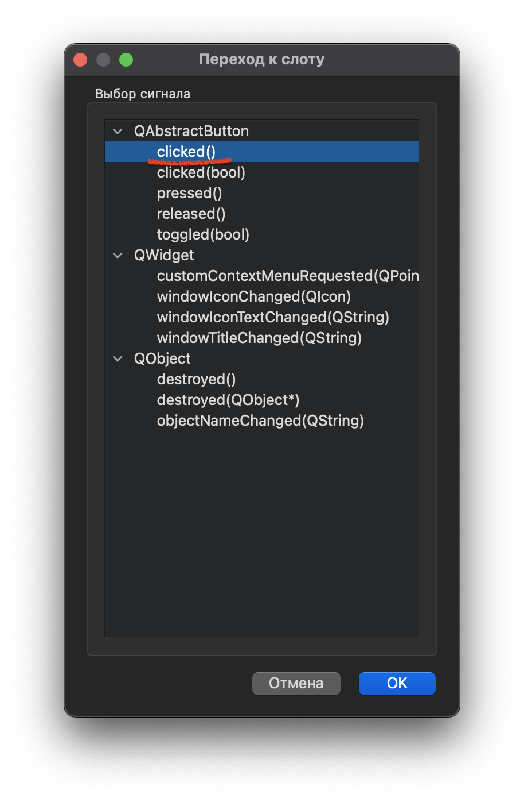
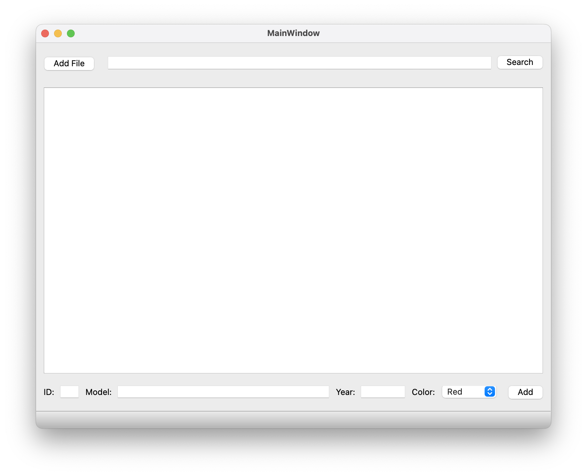

# Объектно-ориентированное программирование  

## Лабораторная работа №2. CSVReader и реализация в ООП стиле  

[***Класс***](#класс)  
[***Свойства и методы***](#свойства-и-методы)  
[***Модификаторы доступа***](#модификаторы-доступа)  
[***Getter & Setter***](#getter--setter)  
[***Конструктор и Деструктор***](#конструктор-и-деструктор)    
[***Конструктор с параметрами***](#конструктор-с-параметрами)  
[***Список инициализации***](#список-инициализации-конструктора)  
[***QtCreator***](#qtcreator)  
[***Задание***](#задание)  
[***Вопросы***](#вопросы)

---  
## Теоретическая справка   

### Класс  

Это абстрактный тип данных, который сочетает в себе два функционала:
* Структура, в которой можно хранить различные типы данных.
* Объектно-ориентированное программирование.

```cpp
class /* Class Name */ {

};
```

### Свойства и методы
У класса есть свойства и методы.  

**`Свойства`** - все, что может хранить инфомацию(переменные, массивы и тд).   

```cpp
class Player {

    int level;
    float HP;
    std::string name;
    std::vector<std::string> skills;
};
```

**`Методы`** - это функции, в функционале которых можно использовать свойства. Методы объявляются в `.h` файле класса, а описываются в отдельном `.cpp` файле класса. 

```cpp
// -------------------------------------- //
//                Player.h
// -------------------------------------- //
class Player {

    //Свойства
    int level;
    float HP;
    std::string name;
    std::vector<std::string> skills;

    //Методы
    void level_up(int lvl);
    std::string getName();
};

// -------------------------------------- //
//                Player.cpp
// -------------------------------------- //

void Player::level_up(int lvl) {
    level += lvl;
}

std::string Player::getName() {
    return name;
}

```  

### Модификаторы доступа.  

У класса, в отличии от структуры, есть модификаторы доступа. Это называют **Инкапсуляцией**. 

**`public`** - дает общий доступ к содержимому, которое в нем указано. К свойствам и методам можно обратиться из любой части программы. По умолчанию все свойства и методы имеют модификатор **`public`**.

**`private`** - запрещает обращаться к свойствам вне класса. Как правило, переменные, массивы, а также прототипы функций создают с этим модификатором доступа. Изменять переменные и прочее можно только из методов класса.   

> P.S Есть еще и третий модификатор доступа - Protected. О нем поговорим позже в лабе с наследованием.


### Getter & Setter

Модификаторы доступа приводят нас к понятию `getter` и `setter`. Так называют методы класса, которые позволяют получить или задать значения свойствам класса, которые имеют модификатор доступа `private`.

`getter` должен иметь тип `void` и принимать в качестве параметра значение, которое мы хотим установить.

`setter` же наоборот должен иметь тип свойства, которое мы будем возвращать.

Изменим код выше и добавим модификаторы доступа, а также геттеры и сеттеры.

```cpp
// -------------------------------------- //
//                Player.h
// -------------------------------------- //
class Player {

private:
    //Свойства
    int level;
    float HP;
    std::string name;
    std::vector<std::string> skills;

public:
    //Методы
    void level_up(int lvl);
    std::string getName(); // <-- В предыдущем примере уже был геттер

    //getter & setter
    void setSkills(std::string skillName);
    float getHP();
};

// -------------------------------------- //
//                Player.cpp
// -------------------------------------- //

void Player::level_up(int lvl) {
    level += lvl;
}

std::string Player::getName() {
    return name;
}

//getter & setter
void Player::setSkills(std::string skillName) {
    skills.push_back(skillName);
}

float Player::getHP() {
    return HP;
}

```

### Конструктор и деструктор.  

**`Конструктор`** — это метод, который вызывается во время создания класса. Конструктор должен называться также, как и сам класс. 

**`Деструктор`** — тоже метод, только вызывается после удаления класса. Деструктор должен называться аналогично, как и констурктор, но с тильдой (~).

```cpp
// -------------------------------------- //
//                Player.h
// -------------------------------------- //
class Player {

public:
    Player();  // <-- Конструктор
    ~Player(); // <-- Деструктор

};

// -------------------------------------- //
//                Player.cpp
// -------------------------------------- //

Player::Player() {
    //Code
    //Example:
    std::cout << "Wake up student! We have labs to burn" << std::endl;
}

Pleyer::~Player(){
    //Code
    //Example:
    std::cout << "Mr. Class I Don't feel so good..." << std::endl;
}
```

### Конструктор с параметрами.

Конструктор может быть с параметрами. Тогда при инициализации объекта класса мы сможем инициализировать какие либо свойства. К примеру, если у нас есть класс игрока, то при его появлении у него должны быть HP, уровень и ник.
```cpp
// -------------------------------------- //
//                Player.h
// -------------------------------------- //
class Player {

private:
    int level;
    float HP;
    std::string name;

public:
    Player();  // <-- Конструктор
    Player(int lvl, float hp, std::string name); // <-- Конструктор с параметрами
};

// -------------------------------------- //
//                Player.cpp
// -------------------------------------- //

Player::Player() {
    std::cout << "Wake up student! We have labs to burn" << std::endl;
}

Player::Player(int lvl, float hp, std::string name) {
    level = lvl;
    HP = hp;
    name = name;
}

// -------------------------------------- //
//                main.cpp
// -------------------------------------- //

Player player(1, 100, "NoobMaster69"); 

//По-скольку мы перегрузили конструктор, то можно не передавать параметры 
//Вариант 
Player player();
//Также будет работать.
```

### Список инициализации конструктора.  

Списки инициализации представляют собой перечисления инициализаторов для каждой из переменных и констант через двоеточие после списка параметров конструктора. 

```cpp
//Конструктор со списком инициализации
Player::Player(): level{ 1 }, HP{ 100 }, name{ "Kirito" } {}

//Конструктор с параметрами
Player::Player(int lvl, float hp, std::string name) {
    level = lvl;
    HP = hp;
    name = name;
}

////Конструктор с параметрами и со списком инициализации.
Player::Player(int lvl, float hp, std::string name): level{lvl}, HP{hp}, name{name} {

}

//P.S Списки инициализации уже встречались раньше в векторах.
std::vector<int> numbers = {3, 1, 4, 1}; //<--тут тоже список инициализации вектора

```

### QtCreator  

### Работа с интерфейсом

Чтобы кнопки интерфейса выполняли какие то действия, нам необходимо создать для них слот. 

Сделать это можно автоматически следующим образом: 
Выбираете нужный вам элемент интерфейса. Пусть будет кнопка.

  


После этого у нас создастся функция, где мы должны описать то, что должна делать кнопка.  

```cpp
void MainWindow::on_findButton_clicked()
{
    //Write code here
}
```

В заголовочном файле класса у нас также появится объявление этой функции с особым модификатором доступа  
```cpp
private slots:
    void on_findButton_clicked();
```

### QString

Qt имеет свой собственный тип данных для работы со строками - **QString**.   

Чтобы перевести из обычной строки в QString используем:  
```cpp
std::string str = "Easy Revenge"; //<--Обычная строка из С++

QString qstr = QString::fromStdString(str); //<-- Перевели в QString
```

Выполнить обратное преобразование можно следующим образом:  
```cpp
QString qstr = "If I have to choose between one evil or another, I'd rather not choose at all";

std::string str = qstr.toStdString();
```

### qDebug

Обычный `cout` из **iostream** не умеет работать с QString, поэтому, если вам необходимо вывести в консоль QString, то используйте `qDebug()`.

```cpp
QString qstr = "Goodnight and Good Luck";

qDebug() << qstr << "\n"; //Output: Goodnight and Good Luck
```


### Работа с файлами в Qt

#### Получить путь до файла

```cpp
#include <QFileDialog>

QString filePath = QFileDialog::getOpenFileName(0, "Open File", "", "*.csv"); 
// "*.csv" - будут отобраться только файлы с таким расширением.
// "*.*" - отображение всех файлов
```
#### Получить имя файла без пути
```cpp
#include <QFile>

QFile file(filePath);                                    //input: ./Argus/SAO/UI.ai
QString fileName = file.fileName().section("/", -1, -1); //output: UI.ai
```
#### Получить расширение файла
```cpp
#include <QFileInfo>

QFileInfo file(filePath);               //input: data.json
QString fileExtension = file.suffix();  //output: .json 
```

---
## **Задание**  
В данной лабораторной работе вам необходимо разработать графический интерфейс и перевести из функционального стиля в ООП стиль код предыдущей лабы. 

Графическое окно должно иметь:
* `TextBrowser` поле для отображения информации.
* `QButton` кнопку поиска и открытия файла.
* `line edit` поле ввода для поиска.  

---  

## **Этапы выполнения**  

1. Создать графический интерфейс.

Пример интерфейса:  



2. Написать класс для хранения данных.

3. Прикрепить интерфейс к коду.

4. Добавить сортировку и вывод данных.  

5. Добавить вывод отсортированных данных в файл.

---

#### **Варианты**   

0. Вариант:

Можете сами придумать себе тему. Главное, чтобы она была аналогична уже данным вариантам.  


1. Вариант:  

Автомобили: 
* ID 
* Марка и модель 
* Тип двигателя (enum: бензин, дизель, гибрид, электро)
* Количество лошадиных сил.

***Отсортировать по количеству лошадиных сил. Вывести все автомобили с бензиновыми двигателями мощностью больше 249 л.с.***   

2. Вариант:   

Фильмы:
* ID
* Название фильма
* Основной жанр (enum: боевик, триллер, романтика, фанастика и тд.)
* Год выпуска

***Отсортировать по году выпуска. Вывести все фильмы жанра романтика, которые вышли после 2010 года.***   

3. Вариант:

Игры:
* ID
* Название игры
* Основной жанр игры (enum: Cyberpunk, RPG, FPS и тд.)
* Год выпуска

***Отсортировать по названию. Вывести все игры жанра RPG старше 2 лет.***   

4. Вариант:

Аниме и сериалы:
* ID
* Название
* Тип (enum: Serial, Movie, OVA)
* Студия, которая выпустила (A-1, Mappa, KyoAni, Netflix, HBO и тд.)

***Отсортировать по названию. Вывести все TV сериалы от Netflix.***

## Вопросы

1. Что такое Класс?
2. Что такое методы и свойства?
3. Что такое конструктор и деструктор?
4. Что такое модификаторы доступа?
5. Что такое конструктор с параметрами?
6. Что такое список инициализации?


