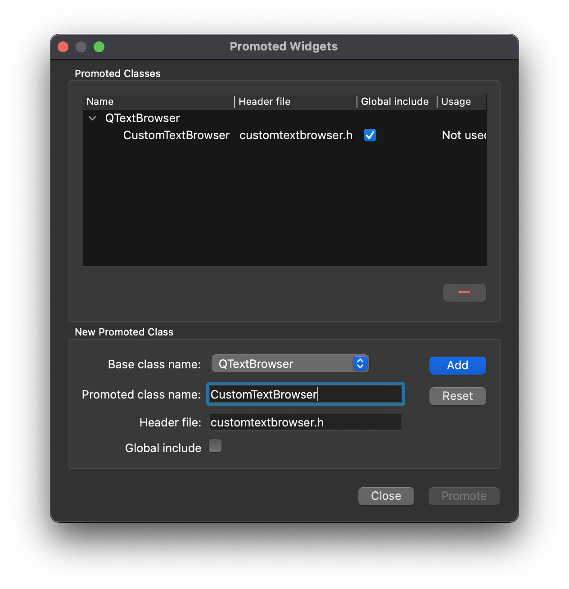
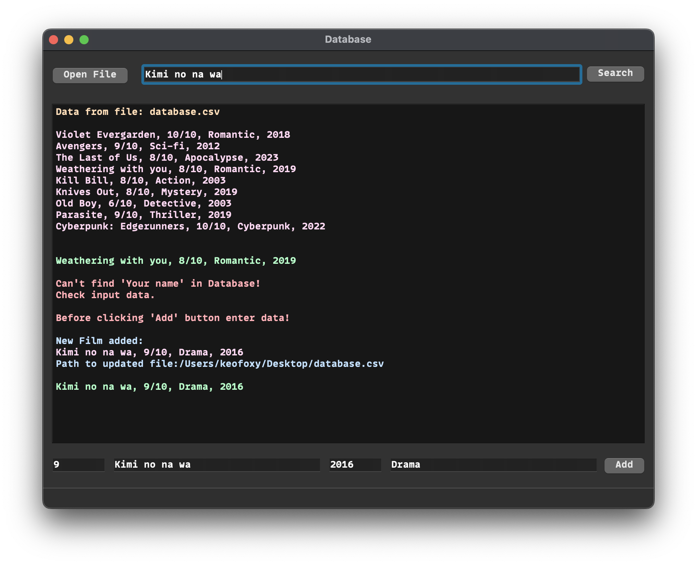

# Объектно-ориентированное программирование  

## Лабораторная работа №4  

[***Наследование***](#наследование)  
[***Констуркторы в наследовании***](#конструкторы)  
[***Protected***](#protected)  
[***Запрет наследования***](#запрет-наследования)  
[***Задание***](#задание)  
[***Вопросы***](#вопросы)


---  
## Теоретическая справка   

### Наследование  
**`Наследование`** (inheritance) представляет один из ключевых аспектов объектно-ориентированного программирования, который позволяет наследовать функциональность одного класса или базового класса (base class) в другом - производном классе (derived class).  

При наследовании все методы и свойства переходят к классу наследнику от его родителя.  

Зачем же это нужно? Давайте покажу на примере:  

Допустим, мы разрабатываем игру и у нас есть игроки и мобы. Их всех нужно как то описать. Что у них есть общее? - Уровень, ХП и имя, но есть и отличия. Вот и напрашивается наследование, если у них есть нечто общее, то можно вынести все общие методы и свойства в отдельный класс и затем от него наследовать остальные. Это значительно сокращает количество кода.
```cpp
class Player {

public:
    int level;
    float HP;
    std::string name;
    std::array<std::string, 10> skills;
};

class Mob {

public:
    int level;
    float HP;
    std::string name;
    std::vector<std::string> lootDropList;
};
```
Перепишем код, но уже через наследование.  
```cpp
class Entity { // <-- Класс сущность, в который мы вынесем все общие свойства и методы

public:
    int level;
    float HP;
    std::string name;
};

class Player : public Entity { // <-- Класс игрока наследуется от класса сущности

public:
    std::array<std::string, 10> skills;
};

class Mob : public Entity { // <-- Класс моба наследуется от класса сущности

public:
    std::vector<std::string> lootDropList;
};
```

Теперь код выглядит чуток чище. Может показаться, что ничего не поменялось, но в реальных проектах свойств и методов у классов могут быть сотни и без наследования ваш код будет каждый раз увеличиваться на 100 и более строк, не говоря уже о том, чтобы это все написать или даже скопировать.  

Чтобы наследовать класс нам необходимо после имени класс поставить **`:`** и затем имя класса, от которого мы хотим наследоваться.  

```cpp
class Player : public Entity
```
Класс `Player` в данном случае называется **производным** классом, а класс `Entity` - **базовым**.  

Перед названием базового класса также можно указать модификатор доступа. Public позволяет использовать в производном классе все открытые члены базового класса. Если не использовать модификатор доступа, то класс `Player` ничего не будет знать о свойствах класса `Entity`.  


### Конструкторы  

При наследовании констуркторы не наследуются. Если базовый класс содержит только конструктор с параметрами, то и производный класс должен вызывать в своем конструкторе один из конструкторов базового класса.  

Рассмотрим на примере:  

```cpp
// -------------------------------------- //
//             Базовый класс
// -------------------------------------- //
class Entity{

public:
    Entity(int lvl, float HP, std::string name) {
        level = lvl; HP = HP; name = name;
    }

private:
    int level;
    float HP;
    std::string name;
};


// -------------------------------------- //
//          Производный класс
// -------------------------------------- //
class Player : public Entity {

public:
    Mob(int lvl, float HP, std::string name, std::string skill) : Entity(lvl, HP, name) {
        skills.push_back(skill);
    }

private:
    std::vector<std::string> skills;
};


// -------------------------------------- //
//               main.cpp
// -------------------------------------- //

Player DavidMartinez(2077, 420, "David Martinez", "Sandevistan");
```

! **Важно** ! Производный класс не может обращаться к свойствам базового класса с модификатором доступа `private`.

```cpp
DavidMartinez.HP = 1337; // error!!! Т.к свойство HP в базовом классе Entity 
                         //имеет модификатор private!
```

### Protected  

Мы уже знаем основые модификаторы достука `public` и `private`. Настало время поговорить про `protected`.  

Иногда нам необходимо сделать так, чтобы некоторые переменные и методы были доступны классам-наследникам, но при этом не были бы доступны извне. Для этого и придумали модификатор `protected`.  

Рассмотрим на примере:  

```cpp
// -------------------------------------- //
//             Базовый класс
// -------------------------------------- //
class Entity {
public:
    Entity(float HP, std::string name) { HP = HP; name = name; }

private: 
    HP;

protected: // <-- Наш заветный модификатор
    std::string name;
};

// -------------------------------------- //
//          Производный класс
// -------------------------------------- //

class Mob : public Entity {
public:
    Mob(float HP, std::string name, bool isBoos) : Entity(HP, name) { isBoss = isBoss; }

    void PrintEntityName() { 
        std::cout << name << std::endl; // <-- Общаемся к свойству из класса Entity
    }                                   //Ошибки не будет

private:
    isBoss;
};

// -------------------------------------- //
//               main.cpp
// -------------------------------------- //
Mob EnderDragon(300, "Ender Dragon", true);
EnderDragon.name = "Wither"; //error Потому что name имеет модификатор protected
                             //Обращаться к ней можно только внутри класса

```

### Запрет наследования  

Когда нибудь может получиться так, что нужно будет запретить наследование. Для этого существует спецификатор **`final`**.  

```cpp
class HalfLife2 final {

};
```

### Наследование классов в QtDesigner

В Qt мы можем писать собственные классы для различных виджетов и затем наследовать их.  

Переходим в дизайнер, делаем активным желаемый виджет, нажимаем ПКМ по нему и выбираем преобразовать в/promote to.    


Далее нам откроется окно:   



Здесь нам нужно написать название нового класса, который уже создан, и преобразовать его.  

После этого вы увидете имя своего класс справа в списке компонентов.  


Теперь TextBrowser может использовать новые цвета.  



Подробнее про цвета и класс QColor можно почитать [тут.](https://doc.qt.io/qt-6/qcolor.html#QColor-3)  


---
## **Задание**  

* Заменить объект `QTextBrowser` на собственный наследованный класс, который будет выводить текст разным цветом. Цвет можно выбрать самому, как и их количество, но не меньше двух.    

---

## Вопросы

1. Что такое базовый и производный класс?
2. Что будет, если убрать модификатор `public` при наследовании? (`class Player : public Entity`)
3. Зачем нужен `final`?  
4. В чем отличие модификатора доступа `protected` от `private`?
5. Что происходит с конструкторами при наследовании?  
