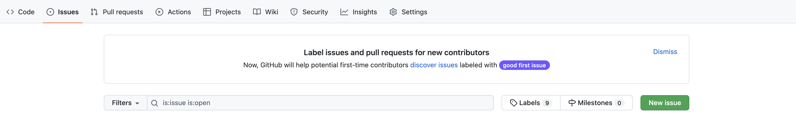

# Известные проблемы и способы их решения   

Если вы столкнулись с какой либо проблемой, то здесь будет ее решение, а если его нет, то пишите в issues.  

  

### Не собирается проект  

* Проверьте, что в пути, по которому находится **build** папка вашего проекта, нету русских символов и пробелов.  
* TBC

<!--
### На MacOS постоянно запрашивает доступ к папкам

Чтобы **Qt Creator** не запрашивал у вас постоянно доступ к папкам, откройте терминал и введите команду:  
`codesign -s - --deep ~/Qt/Qt\ Creator.app`  
-->
### Нет подстветки синтаксиса и автодополнения  

Идем: 

`Help -> About Plugins`  

Листам ниже до раздела с C++. Находим пункт ClangCodeModel и убираем галочку. Перезапускаем Qt Creator.  

TBC...